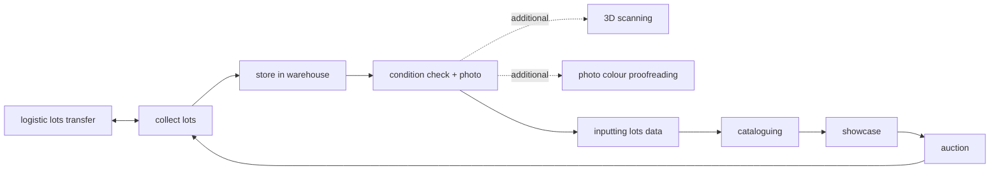
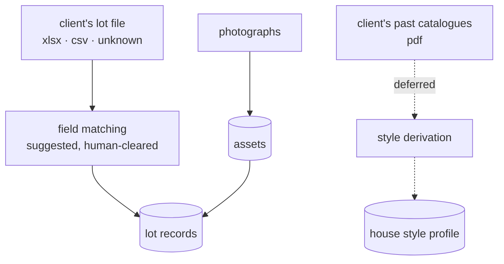
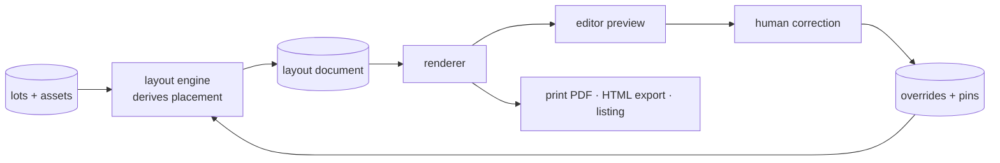

# DFD — what moves, and who owns it

This is the operational cycle the product sits inside, and the honest statement of
which parts of it `taptap3d` owns today, which it will own, and which it only
names so that nothing is homeless later.

It supersedes nothing — it is the first document in this repository. The
predecessor project (`tap3d`, archived private) had a `NORTH_STAR.md` and a
`docs/ARCHITECTURE.md` written for a narrower product; both were deliberately
left behind rather than carried forward, because a stale north star is worse than
none: people follow it.

---

## 1. The cycle

Drawn by the operator, not by us. Every box is a thing a person in an auction
house already does, with or without software.



Two things about this drawing are load-bearing and easy to miss.

**It is a cycle, not a pipeline.** The sale feeds the next consignment. A system
that models it as a one-way funnel will have nowhere to put the lot that fails to
sell and returns to the warehouse for the next sale.

**`3D scanning` and `photo colour proofreading` are bracketed as *additional*.**
They hang off the condition check rather than sitting in the main line. They are
differentiators, not obligations, and the cycle completes without them.

---

## 2. What this system owns

Long-term scope is the whole cycle — the runtime machine a physical business logs
into, in the way Shopify is the runtime machine for online retail. Execution is
**auction-first**, because unique high-value goods are the top of the pyramid: the
GMV is concentrated, the catalogue is already a production artefact, and a
reference there opens doors that a reference in general retail does not.

Generalisation comes when a second vertical asks for it, not before. A model
abstracted before its second customer is abstracted along the wrong axis.

| Cycle box | Day one | Why |
|---|---|---|
| `inputting lots data` | **Built** | The entry point of every demo and the only step no house can skip |
| `cataloguing` | **Built** | The differentiated engine; the reason this product is not a spreadsheet |
| `condition check + photo` | **Partly** — assets attach to lots; the report does not exist | Photography is where the catalogue's raw material comes from; the report is paperwork we have not earned the right to replace |
| `photo colour proofreading` | **Built** | Already exists and is per-plate, keyed like every other correction |
| `3D scanning` | Named only | The name is in the product; the pipeline is not |
| `showcase` | Named only | Becomes the *listing projection* — see §6 |
| `auction` | **Never** | The money path is deferred indefinitely; see §7 |
| `collect lots` · `store in warehouse` · `logistic lots transfer` | Named only | Real ERP work, real competitors, and not where the wedge is |

"Named only" means exactly that: the concept appears in this document and in the
vocabulary, and it gets a table on the day someone actually performs that work
inside the system. It does **not** mean an empty table shipped in advance.

---

## 3. Entities that exist on day one

```
org ──< membership >── user
 │
 └──< event ──< lot ──< asset
        │        │
        │        └──< override        (a human or machine correction)
        │        └──< pin             (an arrangement that must survive re-derivation)
        │
        └──< catalogue ──> [ print PDF | HTML export | listing projection ]
```

`event` is the top-level object a user creates — **not** `sale`. The noun is
deliberately generic: an auction is an event, and so is a gallery show, a
collection launch, a retail drop. The UI is free to display 專案 / project /
sale; what the table is called and what the user reads need not match, and the
generic name is what stops the second vertical requiring a migration.

A `catalogue` is a **child** of an event, not the event itself. This is what makes
the awkward real-world cases expressible without schema change: one catalogue
spanning two sessions, a re-issue, or an event that never produces a catalogue at
all.

Every row carries `org_id` from the first commit. See ARCHITECTURE.md §
*Tenancy*.

---

## 4. The flows

### 4.1 Onboarding — two imports, one screen

The step that gates everything. Clients do not hand over files until there is
something to look at, so the importer must work on a file **nobody on this team
has ever seen**, live, in front of the customer.



Two pipelines, one screen, very different maturity:

- **Lot data** is the critical path. Arbitrary columns arrive; the system
  proposes a mapping to known fields; a human clears it. This must degrade
  gracefully — if what arrives is prose rather than a grid, the screen has to
  offer *paste your text here* rather than fail.
- **Style source** is deferred (ROADMAP M4). When it lands, the material is the
  customer's **own** back catalogue. Deriving one house's taste from another's
  pages would be both useless and, with copyrighted catalogues, improper.

### 4.2 Production — derive, correct, pin



The loop is the product. The engine derives a placement for every lot; the
renderer paints it; a person corrects what they disagree with; the correction
returns to the engine as data and survives the next re-derivation.

**Nothing a human does is stored as pixels or markup.** Every correction is a
value the engine can re-apply — which is what lets a density change from 3-up to
9-up carry a year of human judgement with it.

### 4.3 What crosses each boundary

| Boundary | Carries | Never carries |
|---|---|---|
| import → lots | field values, provenance of the mapping | layout, styling |
| lots → engine | content and measured geometry of assets | opinions about placement |
| engine → document | a complete placement for every element | anything a human typed |
| document → renderer | the tree | database access |
| human → overrides | values keyed `(lot, field)` | element ids, page numbers |
| overrides → engine | the same values, re-applied | rendered output |

The last row is the one that matters most and is stated again in
ARCHITECTURE.md: keys are never positional.

---

## 5. Data stores

| Store | Holds | Notes |
|---|---|---|
| `orgs` / `users` / `memberships` | who, and which org | identity provider deferred; the *schema* is not |
| `events` | the sale / show / drop | top-level object |
| `lots` | the items | `lot` inside the auction vertical; the generic noun is `item` |
| `assets` | photographs, scans, derivatives | content-addressed; shared across orgs only by hash, never by opinion |
| `overrides` | human and machine corrections | keyed `(lot, field)` |
| `pins` | arrangements that must not be re-derived | keyed by **members**, never by page index |
| `catalogues` | an output of an event | |
| `action_log` | every gesture, from commit one | see ARCHITECTURE.md § *Measurement* |

---

## 6. Outputs

One record, more than one destination. This is the product thesis: for a business
that still lives on paper, the catalogue **is** the listing — it just never leaves
the page.

- **Print PDF** — the deliverable that pays for the software today.
- **HTML export** — self-contained, for circulation.
- **Listing projection** *(deferred, M5)* — one lot as channel-neutral structured
  data plus images. The simplest useful form is an **embeddable iframe per lot**.
  The whole-catalogue-online case is a different problem and is not solved by
  repeating the per-lot answer.

Channel adapters — Shopline, Boutir, SleekFlow — are written when a partner is
real. The *projection* is defined early because it constrains the data model; the
adapters are cheap and partner-specific and pointless to build speculatively.

---

## 7. Deliberately outside the system

- **The money path.** No bidding, no checkout, no payments, no settlement. This
  is not a sequencing decision to be revisited quietly — taking money for an
  auction in this jurisdiction is a licensing project, not a feature.
- **Warehouse, logistics, condition reports as paperwork.** Named in §2, built
  when someone does that work here.
- **Being a system of record for the business.** We are the production and
  publication layer. The house's existing systems keep being the truth about
  consignors, contracts and money.

---

*Every decision in this document was argued through before it was written down.
Where you disagree, the argument is worth reopening — but it was made, not
assumed.*
